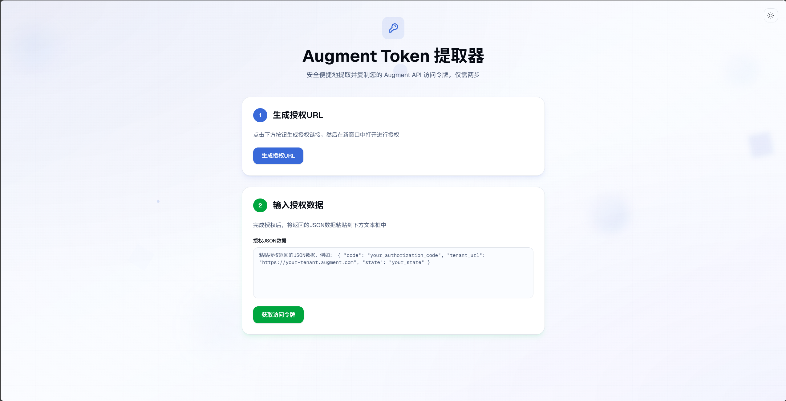
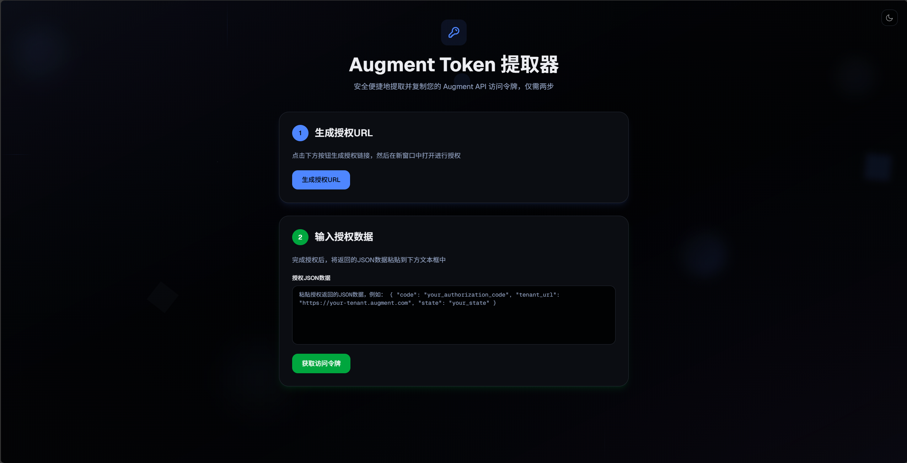
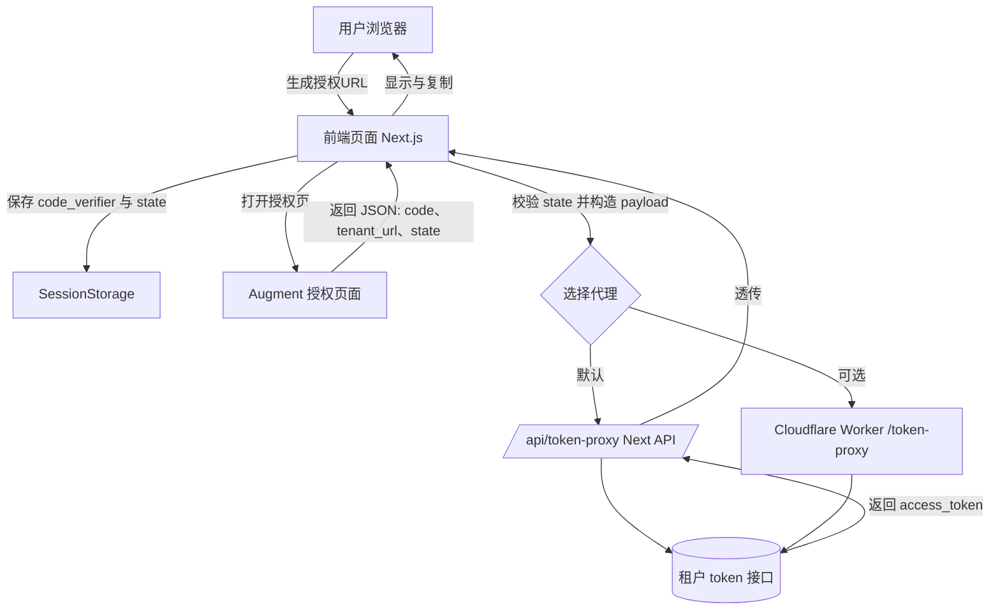
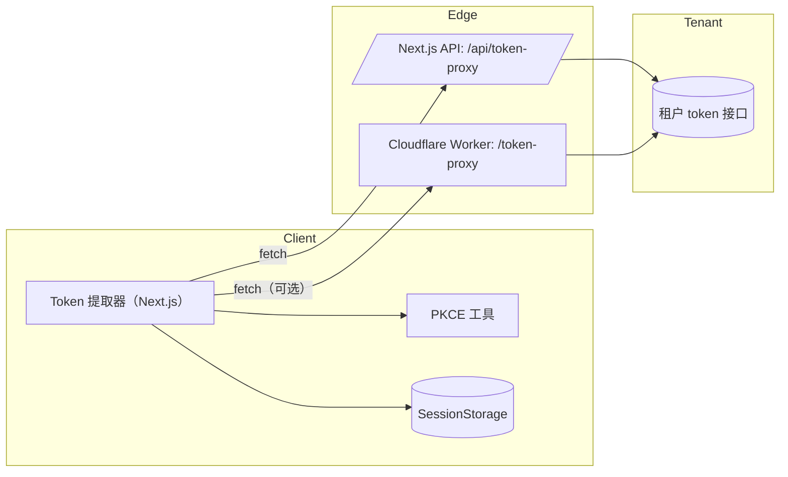

## Augment Token 提取器

一个极简、可离线运行的 Augment API Token 提取工具。支持一键生成授权 URL、粘贴授权 JSON 后获取访问令牌，并可复制令牌与租户 URL。内置 ACE 微交互（按压/涟漪）与浅/暗主题切换。

### 预览截图



## 功能特性
- 授权 URL 生成（PKCE）
- 粘贴授权返回 JSON，交换访问令牌
- 一键复制：授权 URL、访问令牌、租户 URL
- 底部居中 Toast 提示（带进入动画）
- 主题切换（浅色/暗色，跟随系统，持久化）
- 无第三方 UI 依赖，KISS/YAGNI

## 快速开始
### 环境要求
- Node.js 18+（推荐 20）
- pnpm

### 本地运行
```bash
pnpm install
pnpm dev
```
打开 http://localhost:3000

### 使用流程（可视化）
下图展示从生成授权链接到获取访问令牌的完整流程。



1) 点击“生成授权URL”，在新窗口完成授权
2) 将返回的 JSON 粘贴到“授权JSON数据”输入框
3) 点击“获取访问令牌”，复制“访问令牌”和“租户URL”
4) 右上角可切换浅色/暗色主题

## Token 代理（Next.js API）
前端通过 /api/token-proxy 代理到租户的 /token 接口：
- 允许来源：ALLOWED_ORIGINS（默认 *）
- 租户 URL 白名单：TENANT_URL_WHITELIST（可选，逗号分隔）
- 校验：tenant_url 必须以 https:// 开头并以 / 结尾

本地示例（.env.local）：
```
ALLOWED_ORIGINS=*
TENANT_URL_WHITELIST=https://d10.api.augmentcode.com/,https://d18.api.augmentcode.com/
```

手动调用示例：
```bash
curl -X POST http://localhost:3000/api/token-proxy \
  -H "content-type: application/json" \
  -d '{
    "tenant_url": "https://d10.api.augmentcode.com/",
    "payload": {
      "grant_type": "authorization_code",
      "client_id": "<your_client_id>",
      "code_verifier": "<saved_code_verifier>",
      "redirect_uri": "",
      "code": "<authorization_code>"
    }
  }'
```

## 项目结构（核心）
- src/app/page.tsx    页面与交互逻辑
- src/app/layout.tsx  全局布局（主题 Provider、字体）
- src/app/globals.css 全局样式（ACE 动效与动画）
- src/lib/pkce.ts     PKCE 工具
- src/app/api/token-proxy/route.ts Next API 路由
- docs/images         文档图片（将你的截图放到这里）

## 系统架构
下图展示了前端、边缘代理（Next.js API 或 Cloudflare Worker）与租户 Token 接口的通信关系：



## 常用脚本
```bash
pnpm dev     # 本地开发
pnpm build   # 生产构建
pnpm start   # 启动生产构建产物
pnpm lint    # 运行 ESLint（可选）
```

## 部署

### 一键部署网站（Vercel）

[](https://vercel.com/new/clone?repository-url=https%3A%2F%2Fgithub.com%2FYOUR_ORG%2FYOUR_REPO&project-name=augment-token-extractor&repository-name=augment-token-extractor&install-command=pnpm%20install%20--frozen-lockfile&build-command=pnpm%20build&env=ALLOWED_ORIGINS,TENANT_URL_WHITELIST&output-directory=.next)

- 部署完成后，在 Project → Settings → Environment Variables 设置：
  - ALLOWED_ORIGINS：你的前端域名（生产环境不要用 *）
  - TENANT_URL_WHITELIST：允许的租户前缀（逗号分隔，以 / 结尾）

> 将链接中的 YOUR_ORG/YOUR_REPO 替换为当前仓库地址后再点击。

### 一键部署中转站（Cloudflare Worker，可选）

[](https://deploy.workers.cloudflare.com/?url=https%3A%2F%2Fgithub.com%2FYOUR_ORG%2FYOUR_REPO)

- 进入控制台后，按照提示创建 Worker；在 Variables 中设置：
  - ALLOWED_ORIGINS：允许的前端域名（多个用逗号）
  - TENANT_URL_WHITELIST：允许的租户前缀（逗号分隔，以 / 结尾）
- 入口文件：workers/token-proxy.ts（已提供 wrangler.toml）

> 本项目提供两种“令牌交换中转站”：Vercel 的 Next.js API（默认随网站部署），或 Cloudflare Worker（独立部署）。选择其一即可。

### 通过 GitHub Actions 部署

本仓库包含两个工作流：
- .github/workflows/ci.yml：CI 构建与类型检查
- .github/workflows/deploy.yml：推送到 main 时自动部署（可手动 workflow_dispatch）

准备工作（GitHub 仓库 → Settings → Secrets and variables → Actions）：
- Vercel（网站部署）
  - VERCEL_TOKEN：你的 Vercel API Token
  - VERCEL_ORG_ID：Vercel 组织 ID
  - VERCEL_PROJECT_ID：Vercel 项目 ID
  - 在 Vercel 项目环境变量中配置 ALLOWED_ORIGINS、TENANT_URL_WHITELIST（或在 Pull 阶段从 Vercel 同步）
- Cloudflare（Worker 部署，可选）
  - CLOUDFLARE_API_TOKEN：wrangler 部署所需 Token（需有 Workers 权限）
  - CLOUDFLARE_ACCOUNT_ID：你的 Cloudflare 账号 ID

触发方式：
- 直接推送到 main 分支
- 或在 Actions 页面手动运行 Deploy 工作流


## 技术与约定
- Next.js 15（App Router）
- Tailwind CSS v4（@tailwindcss/postcss）
- 路径别名：@/* → src/*（见 tsconfig.json）
- 主题：next-themes（系统/浅色/暗色）
- ACE：.ace-press / .ace-ripple 微交互工具类

## 安全与隐私
- 访问令牌属于敏感数据，请勿提交到仓库或暴露在截图/日志中
- 若误泄露，请立即在服务端吊销并重新生成

## 常见问题
- 复制按钮无效：在 http 或受限环境可能禁用 Clipboard API，已内置回退方案；请尝试使用 https 或常规浏览器
- Toast 不居中：已使用 fixed + translateX(-50%)，如仍异常，请检查浏览器缩放/插件影响
- 代理报 400：检查 tenant_url 是否以 / 结尾，或是否在白名单中

## 许可证
本项目基于 MIT 协议开源，详见 LICENSE 文件。
